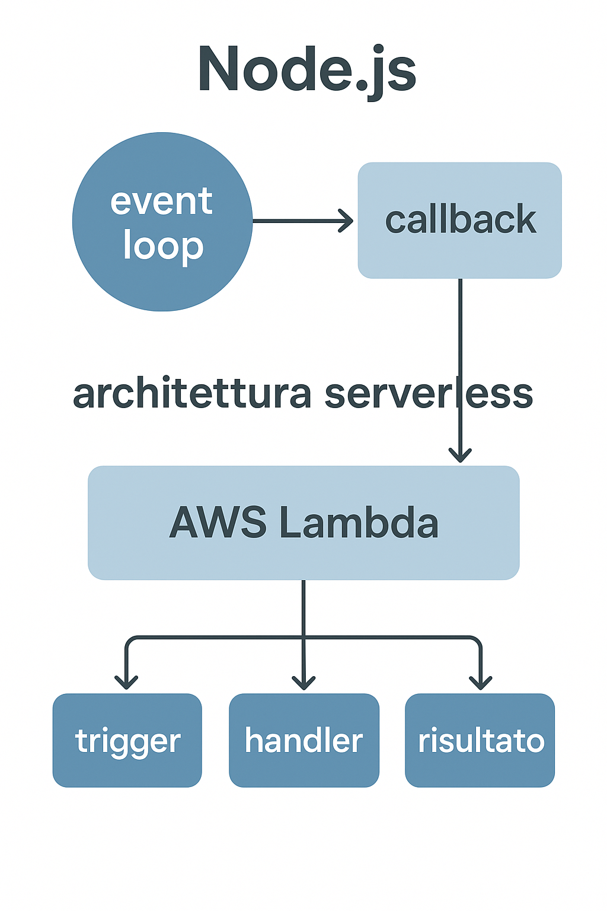

# **Async Model e Event Loop**

In un contesto **serverless**, comprendere come funziona il **modello asincrono** e l’**event loop** di **Node.js** è fondamentale per progettare funzioni efficienti, scalabili e a basso tempo di esecuzione.


Vediamo in dettaglio come questi concetti si applicano.

---

## 🧠 1. Il modello asincrono di Node.js

Node.js è **single-threaded**, ma gestisce **operazioni concorrenti** tramite un **event-driven architecture** basata su **callback, Promise e async/await**.

Nel modello serverless (es. AWS Lambda, Azure Functions, Google Cloud Functions):

* Ogni invocazione è **isolata**: una funzione viene eseguita in un ambiente runtime temporaneo.
* Node.js sfrutta la sua **event loop** per gestire operazioni I/O (HTTP, DB, file, ecc.) in modo **non bloccante**.
* Questo approccio riduce il tempo di attesa e migliora il throughput, sfruttando la **concorrenza senza thread multipli**.

Esempio:

```javascript
exports.handler = async (event) => {
  const data = await fetchDataFromAPI(); // chiamata I/O non bloccante
  return {
    statusCode: 200,
    body: JSON.stringify(data),
  };
};
```

➡️ Durante `fetchDataFromAPI()`, l’event loop continua a gestire altre operazioni o richieste, senza restare bloccato.

---

## 🔄 2. L’Event Loop in ambiente serverless

L’**event loop** è il cuore di Node.js: una coda di eventi che vengono eseguiti in sequenza, ma con la capacità di sospendere e riprendere operazioni asincrone.

Nel **contesto serverless**, il comportamento dell’event loop ha alcune peculiarità:

### a. Lifecycle e “freezing”

* Dopo ogni invocazione, il runtime **può essere riutilizzato** (warm start) o **ricreato da zero** (cold start).
* Se l’event loop **rimane attivo** (timer, socket aperti, connessioni persistenti), il provider cloud può **ritardare la terminazione** o addirittura **riutilizzare lo stato** nella successiva invocazione.

👉 È una buona pratica **chiudere connessioni** (es. DB, socket) o **riutilizzarle con caching globale**:

```javascript
let dbClient;

exports.handler = async (event) => {
  if (!dbClient) {
    dbClient = await connectToDatabase(); // inizializzato una sola volta
  }
  const result = await dbClient.query("SELECT * FROM users");
  return { statusCode: 200, body: JSON.stringify(result) };
};
```

Questo sfrutta il **warm start** e migliora le performance.

---

## ⚙️ 3. Implicazioni pratiche del modello asincrono in serverless

| Aspetto               | Descrizione                                                                                                                                                       |
| --------------------- | ----------------------------------------------------------------------------------------------------------------------------------------------------------------- |
| **Scalabilità**       | Ogni richiesta crea un’istanza isolata, ma l’I/O asincrono riduce il tempo CPU per invocazione.                                                                   |
| **Cold Start**        | La prima esecuzione è più lenta (setup Node, import, connessioni DB). Minimizzabile con lazy loading e connessioni globali.                                       |
| **Timeout e risorse** | Operazioni bloccanti (loop sincroni, CPU-bound) rallentano la funzione e aumentano i costi. Meglio demandarle a servizi dedicati (es. AWS Batch, Step Functions). |
| **Parallelismo**      | Le funzioni non eseguono thread multipli, ma possono gestire più task I/O in parallelo (Promise.all).                                                             |

Esempio con parallelismo asincrono:

```javascript
exports.handler = async () => {
  const [users, orders] = await Promise.all([
    getUsers(),
    getOrders(),
  ]);
  return { users, orders };
};
```

---

## 🚀 4. Best practice per Node.js serverless

1. **Usa async/await ovunque**: codice più chiaro e senza callback hell.
2. **Evita blocchi sincroni** (`fs.readFileSync`, `JSON.parse` di file enormi).
3. **Condividi risorse globali** (es. DB, SDK) tra invocazioni.
4. **Pulisci l’event loop**: nessun `setInterval` o connessione persistente aperta.
5. **Monitora l’event loop lag** (usando strumenti come AWS X-Ray o OpenTelemetry) per identificare colli di bottiglia.

---

## 🧩 In sintesi

| Concetto           | Ruolo nel serverless                                                                 |
| ------------------ | ------------------------------------------------------------------------------------ |
| **Event loop**     | Gestisce I/O in modo non bloccante e permette alta efficienza per invocazioni brevi. |
| **Async model**    | Permette concorrenza interna senza multithreading.                                   |
| **Warm start**     | Riutilizza l’event loop e le connessioni globali.                                    |
| **Cold start**     | Richiede inizializzazione completa del runtime.                                      |
| **Ottimizzazione** | Evitare operazioni CPU-bound, gestire risorse globali e asincrone in modo pulito.    |


---

## ⭐ Architettura

